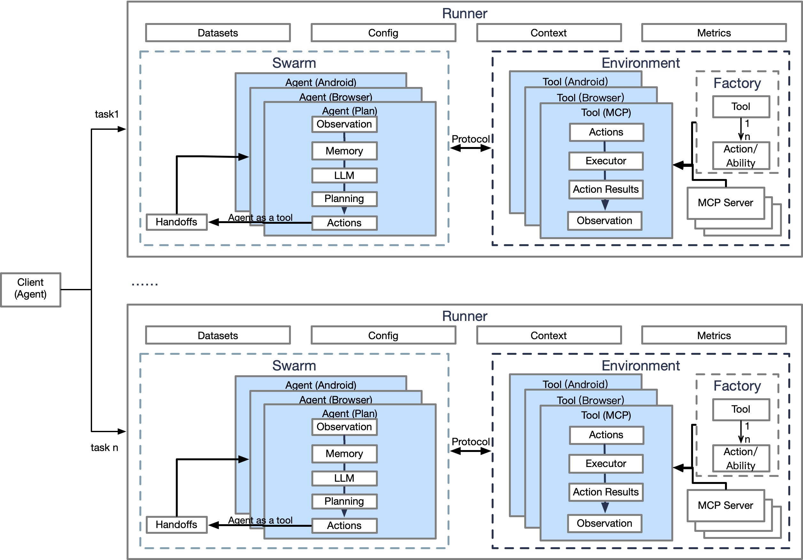

<p align="center">
  
  <br>
  <span align="center" style="font-size: 24px;">
    <b><span style="color: #1677FF;">A</span><span style="color: var(--color-fg-default, #333333);">World</span></b>
  </span>
</p>

> **Build, evaluate and run General Multi-Agent Assistance with ease**

Through AWorld (short for Agent World), you can quickly build real-world scenarios or task automation into agentic prototypes, then extend them into a generic agent or a team of agents to assist your real needs, like Manus.

*Hope AWorld would guide you into the AGI World. GLHF!*




## Installation
With pip (Python>=3.11):
```bash
pip install aworld
```

## Usage
Easily configure and run a pre-defined agent through our web interface:
```bash
aworld-web start
```
Next, input a user query for a quick test. Below are two demos showcasing how a single agent can use both a browser and a phone, respectively.

<p align="left">
  <video src="https://github.com/user-attachments/assets/01ea37e8-6544-4632-b2c3-29a7e356dba8" controls="controls" muted="muted" style="width: 45%;"></video>
</p>

### or Creating Your Own Agents
Here is an example of running tasks from the [GAIA](https://huggingface.co/gaia-benchmark) benchmark:

```python
from aworld import Client
from aworld.agents import AssistantAgent, UserAgent
from aworld.config import AgentConfig, TaskConfig
from aworld.core import Swarm, Task
from aworld.dataset.mock import mock_dataset

# Initialize client
client = Client()

# Create agents
agent1 = UserAgent(conf=AgentConfig(model="gpt-4o",))
agent2 = AssistantAgent(conf=AgentConfig(model="gpt-4o",))

# Create swarm for multi-agents
# define (head_node, tail_node) edge in the topology graph
swarm = Swarm({(agent1, agent2), (agent2, agent1)})

# Create tools
# The tool is globally visible by default, so there is no need for explicit settings

# One sample for example.
one_sample = mock_dataset("gaia")

# Define a task
task = Task(swarm=swarm, input=one_sample, metrics=None)

# Run tasks
result = client.submit(tasks=[task], parallel=False)

# Print the result
print(f"Task completed: {result['success']}")
print(f"Time cost: {len(result['time_cost'])}")
```

## Contributing

If you use AWorld in your research or wish to contact us, please use the following BibTeX entry:

```bibtex
@software{aworld2025,
  author = {Agent Team @ Ant Group},
  title = {AWorld: A Unified Sandbox for Computer Use Tasks},
  year = {2025},
  url = {https://github.com/yourusername/aworld},
  version = {0.1.0},
  publisher = {GitHub},
  email = {chenyi.zcy@antgroup.com}
}
```

## License

This project is licensed under the MIT License - see the [LICENSE](LICENSE) file for details.
