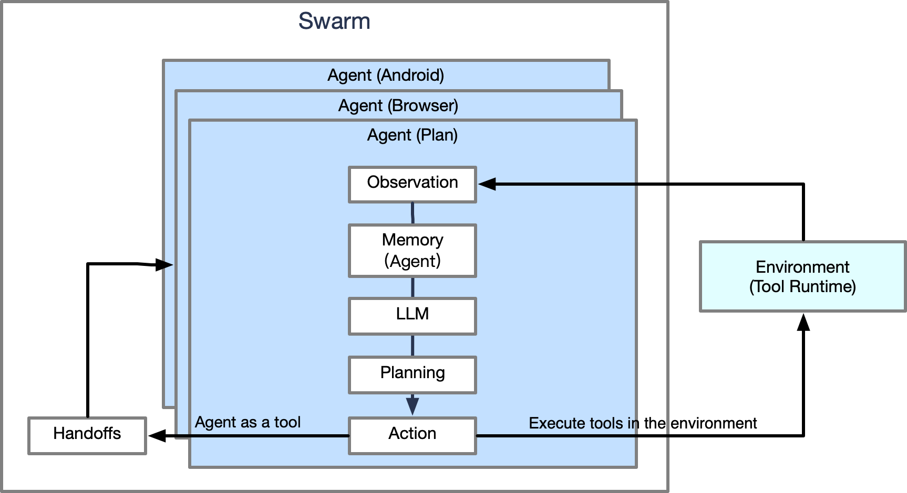

# AI Agents

Intelligent agents that control devices or tools in env using AI models or policy.



Most of the time, we directly use existing tools to build different types of agents that use LLM, 
using frameworks makes it easy to write various agents.

Detailed steps for building an agent:
1. Register your agent to agent factory, and inherit `BaseAgent`
2. Build tools with the description of their actions in __init__, such as variable `self.tool_desc` represents.
3. Implement the `name` method as a name identifier for the agent
4. Build roles messages for LLM input, variable `messages` represents in policy method.
5. Call LLM to obtain its response, such as self.llm.chat.completions.create, or self.llm.invoke(langchain).
6. Distinguish whether to use function/tool calls or not.
7. You can use memory (optional) to improve performance during multiple rounds of interaction.
8. Set the finished status carefully, it's important!
    
We provide a complete and simple example for writing an agent and multi-agent:

```python
import json
from typing import Dict, Any, List, Union

from aworld.config.conf import AgentConfig
from aworld.core.agent.base import AgentFactory, BaseAgent
from aworld.core.common import Agents, Observation, ActionModel, Tools
from aworld.core.envs.tool_desc import get_tool_desc_by_name
from aworld.models.utils import tool_desc_transform

sys_prompt = "You are a helpful search agent."

prompt = """
Please act as a search agent, constructing appropriate keywords and searach terms, using search toolkit to collect relevant information, including urls, webpage snapshots, etc.
Here are some tips that help you perform web search:
- Never add too many keywords in your search query! Some detailed results need to perform browser interaction to get, not using search toolkit.
- If the question is complex, search results typically do not provide precise answers. It is not likely to find the answer directly using search toolkit only, the search query should be concise and focuses on finding official sources rather than direct answers.
  For example, as for the question "What is the maximum length in meters of #9 in the first National Geographic short on YouTube that was ever released according to the Monterey Bay Aquarium website?", your first search term must be coarse-grained like "National Geographic YouTube" to find the youtube website first, and then try other fine-grained search terms step-by-step to find more urls.
- The results you return do not have to directly answer the original question, you only need to collect relevant information.

Here are the question: {task}

Please perform web search and return the listed search result, including urls and necessary webpage snapshots, introductions, etc.
Your output should be like the followings (at most 3 relevant pages from coa):
[
    {{
        "url": [URL],
        "information": [INFORMATION OR CONTENT]
    }},
    ...
]
"""


# Step1
@AgentFactory.register(name=Agents.SEARCH.value, desc="search agent")
class SearchAgent(BaseAgent):

    def __init__(self, conf: AgentConfig, **kwargs):
        super(SearchAgent, self).__init__(conf, **kwargs)
        # Step 2
        # Also can add other agent as tools (optional, it can be ignored if the interacting agent is deterministic.),
        # we only use search api tool for example.
        self.tool_desc = tool_desc_transform({Tools.SEARCH_API.value: get_tool_desc_by_name(Tools.SEARCH_API.value)})

    # Step3
    def name(self) -> str:
        return Agents.SEARCH.value

    def policy(self, observation: Observation, info: Dict[str, Any] = {}, **kwargs) -> Union[
        List[ActionModel], None]:

        if observation.action_result is not None and observation.action_result[0].is_done:
            # Step 8
            self._finished = True
            return [ActionModel(agent_name=Agents.SEARCH.value, policy_info=observation.content)]

        # Step 7.1 (use memory, optional)
        # ignore

        # Step 4
        # messages = [ChatMessage(role='system', content=sys_prompt),
        #             ChatMessage(role='user', content=prompt.format(task=observation.content))]
        # or
        messages = [{'role': 'system', 'content': sys_prompt},
                    {'role': 'user', 'content': prompt.format(task=observation.content)}]

        # Step5
        llm_result = self.llm.chat.completions.create(
            messages=messages,
            model=self.model_name,
            **{'temperature': 0, 'tools': self.tool_desc},
        )
        content = llm_result.choices[0].message.content
        tool_calls = llm_result.choices[0].message.tool_calls

        # Step 7.2 (use memory, optional)

        # Step6
        if tool_calls:
            return self._result(tool_calls)
        else:
            # use variable `content` to do something if there is no need to call the tools
            # Unable to use tools, replan by plan agent
            return [ActionModel(agent_name=Agents.PLAN.value, policy_info=content)]

    def _result(self, tool_calls):
        results = []
        for tool_call in tool_calls:
            tool_action_name: str = tool_call.function.name
            if not tool_action_name:
                continue
            tool_name = tool_action_name.split("__")[0]
            action_name = tool_action_name.split("__")[1]
            params = json.loads(tool_call.function.arguments)
            results.append(ActionModel(tool_name=tool_name,
                                       action_name=action_name,
                                       params=params,
                                       agent_name=Agents.SUMMARY.value))
            break
        return results

```

It can also quickly develop multi-agent based on the framework.

On the basis of the above agent(SearchAgent), we provide a multi-agent example:

```python
from typing import Dict, Any, List, Union

from aworld.config.conf import AgentConfig
from aworld.core.agent.base import AgentFactory, BaseAgent
from aworld.core.common import Agents, Observation, ActionModel


summary_sys_prompt = "You are a helpful general summary agent."

summary_prompt = """
Summarize the following text in one clear and concise paragraph, capturing the key ideas without missing critical points. 
Ensure the summary is easy to understand and avoids excessive detail.

Here are the content: 
{content}
"""


# Step 1
@AgentFactory.register(name=Agents.SUMMARY.value, desc="summary agent")
class SummaryAgent(BaseAgent):

    def __init__(self, conf: AgentConfig, **kwargs):
        super(SummaryAgent, self).__init__(conf, **kwargs)
        # Step 2 (Optional, it can be ignored if the interacting agent is deterministic.)

    # Step 3
    def name(self) -> str:
        return Agents.SUMMARY.value

    def policy(self, observation: Observation, info: Dict[str, Any] = {}, **kwargs) -> Union[
        List[ActionModel], None]:
        # Step 4
        # messages = [ChatMessage(role='system', content=sys_prompt),
        #             ChatMessage(role='user', content=prompt.format(content=observation.content))]
        # or
        messages = [{'role': 'system', 'content': summary_sys_prompt},
                    {'role': 'user', 'content': summary_prompt.format(content=observation.content)}]

        # Step 7.1 (use memory, optional)
        # ignore

        # Step 5
        llm_result = self.llm.chat.completions.create(
            messages=messages,
            model=self.model_name,
        )

        # Step 6, use tool call or content depends on the result and user
        content = llm_result.choices[0].message.content
        res = [ActionModel(agent_name=Agents.SEARCH.value, policy_info=content)]

        # Step 7.2 (use memory, optional)

        # Step 8
        self._finished = True
        return res
```

You can run single-agent or multi-agent through Swarm.
NOTE: Need to set some environment variables first! Effective GOOGLE_API_KEY, GOOGLE_ENGINE_ID, OPENAI_API_KEY and OPENAI_ENDPOINT.

The OPENAI_API_KEY and OPENAI_ENDPOINT can be used as a parameter, example in the following code:

```python

from aworld.config.conf import AgentConfig
from aworld.core.client import Client
from aworld.core.swarm import Swarm
from aworld.core.task import Task

if __name__ == '__main__':
    task = "search 1+1=?"
    search_agent = SearchAgent(AgentConfig(
        llm_provider="openai",
        llm_model_name="gpt-4o",
        llm_api_key="sk-",
        llm_base_url=""
    ))
    summary_agent = SummaryAgent(AgentConfig(
        llm_provider="openai",
        llm_model_name="gpt-4o",
        llm_api_key="sk-",
        llm_base_url=""
    ))
    # build topology graph, the correct order is necessary
    swarm = Swarm((search_agent, summary_agent))
    # single-agent
    # swarm = Swarm(search_agent)
    Client().submit(Task(input=task, swarm=swarm))
```