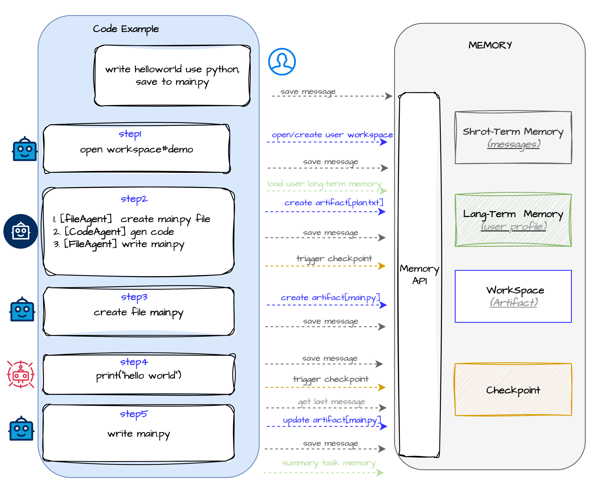

## multi-agents memory


### Short-Term Memory

Short-term memory (InMemory) is suitable for lightweight, temporary multi-agent memory scenarios. Data is only stored in memory, making it ideal for testing and small-scale experiments.

**Usage Example:**

```python
from aworld.core.memory import MemoryConfig, MemoryItem
from aworld.memory.main import MemoryFactory

# Create InMemory config
memory_config = MemoryConfig(provider="inmemory", enable_summary=False)
# Initialize Memory
memory = MemoryFactory.from_config(memory_config)

# Add a memory item
memory.add(MemoryItem(content="Hello, world!", metadata={"user_id": "u1"}, tags=["greeting"]))

# Get all memory items
all_memories = memory.get_all()
for item in all_memories:
    print(item.content)
```

### Long-Term Memory

Long-term memory (Mem0) is suitable for persistent, vectorized retrieval and summarization in multi-agent scenarios. It supports LLM-based summarization and vector storage.

**Usage Example:**

```python
from aworld.core.memory import MemoryConfig, MemoryItem
from aworld.memory.main import MemoryFactory

# Create Mem0 config (requires mem0 and related dependencies)
memory_config = MemoryConfig(
    provider="mem0",
    enable_summary=True,           # Enable summarization
    summary_rounds=5,              # Generate a summary every 5 rounds
    embedder_provider="huggingface", # Embedding model provider
    embedder_model="all-MiniLM-L6-v2", # Embedding model name
    embedder_dims=384
)
# Initialize Memory
memory = MemoryFactory.from_config(memory_config)

# Add a memory item
memory.add(MemoryItem(content="The agent visited Hangzhou.", metadata={"user_id": "u1"}, tags=["travel"]))

# Get all memory items
all_memories = memory.get_all()
for item in all_memories:
    print(item.content)
```

> Note: To use mem0, you must install `mem0` and `sentence-transformers` in advance, and configure the required LLM environment variables.

### CheckPoint
TODO