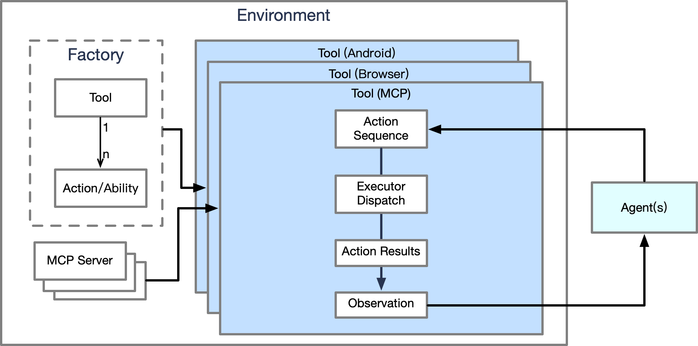

# Environments

Virtual environments for execution of various tools.

Running on the local, we assume that the virtual environment completes startup when the python application starts.



Detailed steps for building a tool:
1. Register action of your tool to action factory, and inherit `ExecutableAction`
2. Implement the `act` or `async_act` method 
3. Register your tool to tool factory, and inherit `EnvTool` or `AsyncEnvTool`
4. Build __init__ to initialize related information.
5. Implement the `name` method as a name identifier for the tool
6. Write the `step` method to execute the abilities in the tool and generate observation, update finished Status.


We provide a simple example for writing a tool:

```python
from typing import List, Tuple, Dict, Any

from aworld.core.common import ActionModel, Observation, Tools
from aworld.core.envs.env_tool import ActionFactory, EnvTool, ToolFactory, ToolInput, AgentInput
from aworld.core.envs.tool_action import GymAction
from aworld.virtual_environments.action import ExecutableAction

@ToolFactory.register(name=Tools.GYM.value, desc="gym classic control game", supported_action=GymAction)
class OpenAIGym(EnvTool[Observation, List[ActionModel]]):
    def step(self, action: ToolInput, **kwargs) -> Tuple[AgentInput, float, bool, bool, Dict[str, Any]]:
        ...
        state, reward, terminal, truncate, info = self.env.step(action)
        ...
        return (Observation(content=state),
                reward,
                terminal,
                truncate,
                info)


@ActionFactory.register(name=GymAction.PLAY.value.name,
                        desc=GymAction.PLAY.value.desc,
                        tool_name=Tools.GYM.value)
class Play(ExecutableAction):
    """There is only one Action, it can be implemented in the tool, registration is required here."""
```
You can view the example [code](gym/openai_gym.py) to learn more.
